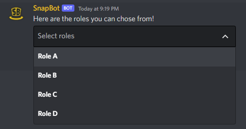

<h1 align="center">
<p>
    
</p>
<p>
SnapCogs
</p>
</h1>
<p align="center">
    A collection of Cogs for discord.py bots
</p>

This project is a collection of general-use modules, called Cogs, for discord bots written with the [discord.py][dpy] v2.0 Python library.

# Installation

:warning: **Important Note: These cogs are written with discord.py >= 2.0 in mind.**

To install the modules, you can install them directly from the repository's master branch:

```
pip install -U "git+https://github.com/Snaptraks/SnapCogs@master"
```

To install with optional dependencies, use:

```
pip install -U "snapcogs[deps-here] @ git+https://github.com/Snaptraks/SnapCogs@master"
```

where ``deps-here`` is a comma seperated list of the following:
- ``development``
- ``horoscope``
- ``timestamps``

Then load the extensions in your bot's code **inside the ``setup_hook`` method**:

```py
import asyncio
from discord.ext import commands

class MyBot(commands.Bot):
    async def setup_hook(self):
        await self.load_extension("snapcogs.<COGNAME>")

async def main():
    bot = MyBot(...)
    async with bot:
        await bot.start(TOKEN)

asyncio.run(main())
```

where ``<COGNAME>`` is one of the modules in [Cogs Description](#cogs-description).
You can of course load more than one cog:

```py
import asyncio
from discord.ext import commands

class MyBot(commands.Bot):
    async def setup_hook(self):
        startup_extensions = [
            "my_cogs_folder.SomeCog",
            "snapcogs.Admin",
            "snapcogs.Poll",
        ]
        for extension in startup_extensions:
            await self.load_extension(extension)

async def main():
    bot = MyBot(...)
    async with bot:
        await bot.start(TOKEN)
```

For ease of use, the package comes with a ``commands.Bot`` subclass that takes the extensions to load at startup as a keyword argument.

```py
from snapcogs import Bot

async def main():
    startup_extensions = [
        "my_cogs_folder.SomeCog",
        "snapcogs.Admin",
        "snapcogs.Poll",
    ]
    bot = Bot(..., startup_extensions=startup_extensions)
    async with bot:
        await bot.start(TOKEN)

```

# Bot Subclass

We provide a ``commands.Bot`` subclass that handles the creation of a SQLite database and other utilities needed for the cogs to work properly.

This subclass also provides a custom ``on_command_error`` where errors that are explicitely not handled by the command's or cog's error handler will be logged with the ``logging`` module. This is different from the default behaviour from ``discord.py`` where errors were silenced no matter what when an error handler was found.

To make sure errors are logged here even when application commands have an error handler, you should use the following pattern for the handler:

```py
async def error_handler(ctx: commands.Context, error: Exception):
    if isinstance(error, ...):
        # do something here
    elif isinstance(error, ...):
        # for another type of exception
    else:
        # this is the important part
        ctx.error_handled = False
```

# CommandTree Subclass

Similar to the ``Bot`` subclass, we provide a custom ``app_commands.CommandTree`` subclass that overwrites the ``on_error`` method to log errors to the logger, whenever errors are explicitely not handled.
By default, the ``Bot`` subclass will use this custom ``CommandTree``.

To make sure errors are logged here even when commands have an error handler, you should use the following pattern for the handler:

```py
async def error_handler(interaction: discord.Interaction, error: Exception):
    if isinstance(error, ...):
        # do something here
    elif isinstance(error, ...):
        # for another type of exception
    else:
        # this is the important part
        interaction.extras["error_handled"] = False
```

# Cogs Description

Here is a list of the cogs, and their functionalities.
Application commands (``discord.app_commands.AppCommand``s) are prefixed with the ``/`` character.
Context menus (right click) are indicated as ``User | Member > command_name`` or ``Message > command_name``, and ``discord.ext.commands.Command``s are left without prefix (you are free to use your own prefix).
Required arguments in commands are marked with angle brackets ``<>``, and optional ones with square brackets ``[]``.

## Admin

**The cog has a bot owner check. Only the bot owner(s) can use these commands.**

### ``sync [guilds]... ["~" or None]``
Sync AppCommands to the provided guilds or globally if none are passed, or to the current guild if "~" is passed instead.

### ``clear [guilds]... ["~" or None]``

Clear AppCommands of the provided guilds or globally if none are passed, or of the current guild if "~" is passed instead.

### ``repl``
Launch an interactive REPL session. A Read-Eval-Print-Loop allows you to run code interactively. This is a possibly very dangerous command, so be careful who can use it! For ease of use, some variables are defined automatically:
  - `ctx`: ctx
  - `bot`: ctx.bot
  - `message`: ctx.message
  - `guild`: ctx.guild
  - `channel`: ctx.channel
  - `author`: ctx.author

## Announcements

Commands to announce stuff in your server, such as members birthdays!

### ``/birthday register``

Register your birthday on the current server.

### ``/birthday next``

Display the next birthday in the current server.

### ``/birthday celebrate <member>``

Celebrate a member's birthday in the current server.

## Development

### ``/charinfo [characters]``

Show information on up to 25 unicode characters. This includes unicode endpoints and string literals.

## Fun

### ``/8ball <question>``

Fortune-telling or advice seeking. Ask the Magic 8 Ball a yes-or-no question, and maybe it will answer!

### ``/bonk <member> [text=None]``

Bonk a member, and add a message! This command creates an image with the member's profile picture and the bonk meme.

## Horoscope

### ``/horoscope <zodiac_sign>``

Get today's horoscope for the given Zodiac sign. Information is taken from [horoscope.com][horoscope].

## Information

### ``/about``

View information about the bot itself. This includes servers statistics, and possible link to the bot's repository.

### ``/info server``

View information about the current server. This include members and channels statistics.

### ``/info user <user>``

View information about a user / member. This includes individual user data such as their ID and account creation date, and possibly server join date and roles (if used in a server context).

### ``Member > Info``

Member context menu similar to the ``/info user`` command.

## Roles

### ``/roles select [channel] [content]``

Create a role selection menu, to select many roles from the list. By defaut, send the menu in the current channel, but can be specified with the ``channel`` argument. The ``content`` of the message can also be specified, and will show above the selection menu.

### ``/roles toggle [channel] [content]``

Create a role selection menu, to select **one** role from the list. By defaut, send the menu in the current channel, but can be specified with the ``channel`` argument. The ``content`` of the message can also be specified, and will show above the selection menu.

### ``/roles add <message>``

Add a role to the selection menu. You need to specify the message by either it's ID (123456789123456789), combo \<channel ID>-\<message ID> (Shift + Copy ID), or jump url (Copy Message Link).

### ``/roles remove <message>``

Remove a role to the selection menu. You need to specify the message in the same way as mentionned above.

### ``/roles edit <message> <content>``

Edit the content of a role selection menu message. YYou need to specify the message in the same way as mentionned above.

### ``/roles delete <message>``

Delete a role selection menu message. This way ensures that the data is also deleted from the bot. You need to specify the message in the same way as mentionned above.

Example of a roles selection menu:



## Timestamps

This cog allows to create nicely formatted Discord timestamps ([example here][timestamp]) from a provided time and time zone.
The arguments in the following commands all feature autocompletes, so be sure to use them to avoid errors!

### ``/now [style]``

Create timestamps of now to send to get rich formatting.

### ``/timestamp <datetime> <timezone> [style]``

Create timestamps of the given time to send to get rich formatting.

## Tips

### ``/tip create``

Create a new tip for the current server, owned by you. This sends a modal to the user, with a form to fill out. Tips support markdown and mentions.

### ``/tip show <name>``

Show a tip in the current channel. This command, as well as all the others taking a tip's name as argument, feature autocomplete with a list of names similar to what is being typed. This command autocompletes from all tips in the server.

### ``/tip edit <name>``

Modify the content of a tip that you own. This sends a modal to the user with the current tip data already filled out. The autocomplete will only suggest tip names that are written by you.

### ``/tip info <name>``

Get information about a tip. The information provided includes the tip's author, when it was created and last edited, and number of uses (one usage is recorded when ``/tip show`` is used).

### ``/tip raw <name>``

Get the raw content of a tip, escaping markdown. This is useful when trying to see how a tip was formatted.

### ``/tip delete <name>``

Delete a tip that you wrote. Members with the ``Manage Messages`` server permission, as well as the bot author, can delete tips from other members.

### ``/tip purge <member>``

Delete all tips from the given member in this server. You need the ``Manage Messages`` server permission to be able to use this command.

### ``/tip transfer <name> <member>``

Transfer tip ownership to another member. You can only transfer tips that you own, to another member that isn't you, or a bot!

### ``/tip claim <name>``

Claim a tip where the author has left the server.

### ``/tip list [member]``

List all the tips that you, or someone else, wrote. Using this command without the ``member`` argument will list your tips.

### ``/tip all``

List all the tips from this server.

### ``/tip stats [member]``

Get statistics for a member or the whole server. Using this command without the ``member`` argument will show statistics for the whole server. Member statistics include total tips and tips usage, as well as the top 3 tips most used in the server. Server statistics add the top 3 members with the most written tips.

## utils

The ``snapcog.utils`` package is not a Cog, but rather a collection of useful objects and functions, some necessary for the rest of the package. The following are therefore not application commands, context menus, nor text commands.

### ``snapcog.utils.relative_dt(dt: datetime.datetime) -> str``

A shortcut for ``discord.utils.format_dt(dt, style="R")`` used here.

### ``await snapcog.utils.run_process(command: str) -> tuple[str]``

Run a command in shell. This then returns the `stdout` and `stderr` inside a tuple. This is potentially dangerous, so be careful how you use it!

### Checks

### ``snapcogs.utils.checks.has_guild_permissions(**permissions: bool)``

Similar to `app_commands.checks.has_permissions`, but operates on guild wide permissions instead of the current channel permissions. If this check is called in a DM context, it will raise an exception, `app_commands.NoPrivateMessage`. Ported from `discord.ext.commands` and adapted for ApplicationCommands.

### ``snapcogs.utils.checks.bot_has_guild_permissions(**permissions: bool)``

Similar to `app_commands.checks.has_guild_permissions`, but checks the bot members guild permissions. Ported from `discord.ext.commands` and adapted for ApplicationCommands.

### Views

### ``snapcogs.utils.views.Confirm``

A view that asks the user to confirm a choice, by the press of ``ui.Buttons``.

### ``snapcogs.utils.views.confirm_prompt(interaction: discord.Interaction, content: str) -> bool``

Sends a message to the user from the interaction, with ``views.Confirm`` attached to it. Once the interaction is done, returns a ``bool`` whether or not the action was confirmed.

### Transformers

### ``snapcogs.utils.transformers.MessageTransformer`` and ``BotMessageTransformer``

Application command transformers that converts an argument to a `discord.Message`. The `Bot` version ensures that the message's author was the bot itself.

### Errors

### ``snapcogs.utils.errors.TransformerMessageNotFound``

Exception raised by `MessageTransformer` when the message could not be found.

### ``snapcogs.utils.errors.TransformerNotBotMessage``

Exception raised by `BotMessageTransformer` when the provided message was not sent by the bot.

## Used by
- [HatBot][hatbot]: Bot for the Hatventures Community Discord server
- [Zenyatta][zenyatta]: Bot for a single private server
- [PhysBot][physbot]: Bot for the PHYSUM Discord server

## Acknowledgements

The SnapCogs logo was created using the [Unicorn icon created by rddrt - Flaticons][unicorn] and the [Development icons created by Smashicons - Flaticon][cog]

[dpy]: https://github.com/Rapptz/discord.py
[horoscope]: https://www.horoscope.com/us/index.aspx
[timestamp]: https://discordpy.readthedocs.io/en/latest/api.html?highlight=format_dt#discord.utils.format_dt
[hatbot]: https://github.com/Snaptraks/HatBot
[zenyatta]: https://github.com/Snaptraks/Zenyatta
[physbot]: https://github.com/Snaptraks/physbot
[unicorn]: https://www.flaticon.com/free-icons/unicorn
[cog]: https://www.flaticon.com/free-icons/development
