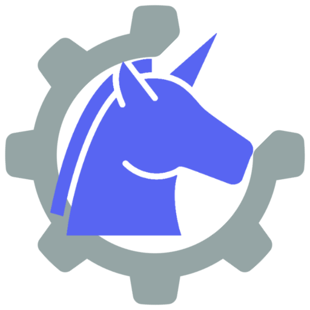

<h1 align="center">
<sub>
    
</sub>
&nbsp;
SnapCogs
</h1>
<p align="center">
    A collection of Cogs for discord.py bots
</p>

<!-- # SnapCogs: A collection of Cogs for discord.py bots -->

This project is a collection of general-use modules, called Cogs, for discord bots written with the discord.py v2.0 Python library.

## Installation

:warning: **Important Note: These cogs are written with discord.py >= 2.0 in mind, which is still unreleased.
While the work continues to be done on the library, you will need to install it manually from github with ``pip install -U git+https://github.com/Rapptz/discord.py.git`` for the time being.**

To install the modules, you can install them directly from the repository's master branch:

```
pip install -U "git+https://github.com/Snaptraks/SnapCogs@master"
```

Then, in your bot's code before it is started:

```py
await bot.load_extension("snapcogs.<COGNAME>")
```

where ``<COGNAME>`` is one of the modules in [Cogs Description](#cogs-description).
You can of course load more than one cog:

```py
startup_extensions = [
    "snapcogs.Admin",
    "snapcogs.Poll",
]
for extension in startup_extensions:
    await bot.load_extension(extension)
```

## Cogs Description

Here is a list of the cogs, and their functionalities.
Application commands (``discord.app_commands.AppCommand``s) are prefixed with the ``/`` character.
Context menus (right click) are indicated as ``User | Member > command_name`` or ``Message > command_name``, and ``discord.ext.commands.Command``s are left without prefix (you are free to use your own prefix).

### Admin

**The cog has a bot owner check. Only the bot owner(s) can use these commands.**

> **\>** ``sync [guilds]... ["~" or None]``
>
> Sync AppCommands to the provided guilds or globally if none are passed, or to the current guild if "~" is passed instead.

> **\>** ``clear [guilds]... ["~" or None]``
>
> Clear AppCommands of the provided guilds or globally if none are passed, or of the current guild if "~" is passed instead.

### Fun

> **\>** ``/bonk <member> [text=None]``
>
> Bonk a member, and add a message! This command creates an image with the member's profile picture and the bonk meme. This doubles as a ``commands.Command``, although the "slash" syntax is prefered.

> **\>** ``Member > Bonk``
>
> Member context menu similar to the ``bonk`` command, without the optional text.

>**\>** ``Member > Lick``
>
> Member context menu that overlays the member's profile picture with a lick gif.

### Poll

> **\>** ``/poll single``
>
> Send a modal to the command author to create a single-choice poll, then send the poll to the channel the command was invoked in.

> **\>** ``/poll multiple``
>
> Send a modal to the command author to create a multiple-choice poll, then send the poll to the channel the command was invoked in.

> **\>** ``/poll yes-no``
>
> Shortcut for a single-choice poll with the options filled in with Yes or No automatically.

## Used by
- [Zenyatta][zenyatta]: Bot for a single private server
- [PhysBot][physbot]: Bot for the PHYSUM Discord server

## Acknowledgements

The SnapCogs logo was created using the [Unicorn icon created by rddrt - Flaticons][unicorn] and the [Development icons created by Smashicons - Flaticon][cog]

[zenyatta]: https://github.com/Snaptraks/Zenyatta
[physbot]: https://github.com/Snaptraks/physbot
[unicorn]: https://www.flaticon.com/free-icons/unicorn
[cog]: https://www.flaticon.com/free-icons/development
