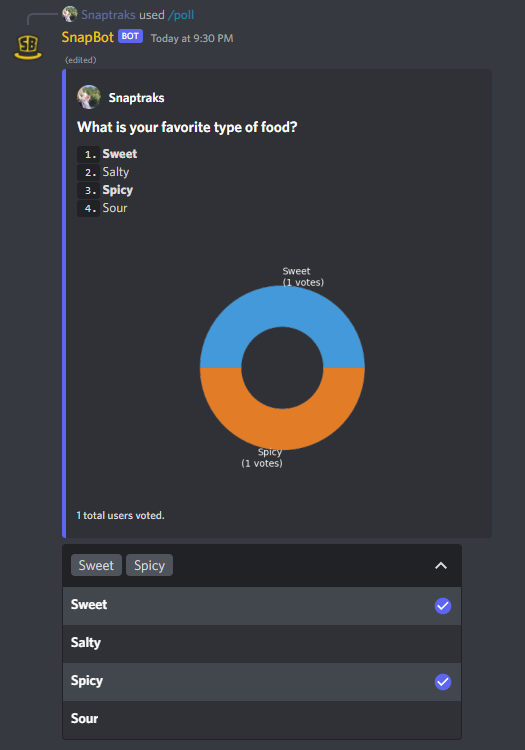

<h1 align="center">
<p>
    
</p>
<p>
SnapCogs
</p>
</h1>
<p align="center">
    A collection of Cogs for discord.py bots
</p>

This project is a collection of general-use modules, called Cogs, for discord bots written with the [discord.py][dpy] v2.0 Python library.

## Installation

:warning: **Important Note: These cogs are written with discord.py >= 2.0 in mind, which is still unreleased.
While the work continues to be done on the library, you will need to install it manually from github with ``pip install -U git+https://github.com/Rapptz/discord.py.git`` for the time being.**

To install the modules, you can install them directly from the repository's master branch:

```
pip install -U "git+https://github.com/Snaptraks/SnapCogs@master"
```

Then load the extensions in your bot's code **inside the ``setup_hook`` method**:

```py
import asyncio
from discord.ext import commands

class MyBot(commands.Bot):
    async def setup_hook(self):
        await self.load_extension("snapcogs.<COGNAME>")

async def main():
    bot = MyBot(...)
    async with bot:
        await bot.start(TOKEN)

asyncio.run(main())
```

where ``<COGNAME>`` is one of the modules in [Cogs Description](#cogs-description).
You can of course load more than one cog:

```py
import asyncio
from discord.ext import commands

class MyBot(commands.Bot):
    async def setup_hook(self):
        startup_extensions = [
            "my_cogs_folder.SomeCog",
            "snapcogs.Admin",
            "snapcogs.Poll",
        ]
        for extension in startup_extensions:
            await self.load_extension(extension)

async def main():
    bot = MyBot(...)
    async with bot:
        await bot.start(TOKEN)
```

For ease of use,  the package comes with a ``commands.Bot`` subclass that takes the extensions to load at startup as a keyword argument.

```py
from snapcogs import Bot

async def main():
    startup_extensions = [
        "my_cogs_folder.SomeCog",
        "snapcogs.Admin",
        "snapcogs.Poll",
    ]
    bot = Bot(..., startup_extensions=startup_extensions)
    async with bot:
        await bot.start(TOKEN)

```

## Bot Subclass

We provide a ``commands.Bot`` subclass that handles the creation of a SQLite database and other utilities needed for the cogs to work properly.

## Cogs Description

Here is a list of the cogs, and their functionalities.
Application commands (``discord.app_commands.AppCommand``s) are prefixed with the ``/`` character.
Context menus (right click) are indicated as ``User | Member > command_name`` or ``Message > command_name``, and ``discord.ext.commands.Command``s are left without prefix (you are free to use your own prefix).

### Admin

**The cog has a bot owner check. Only the bot owner(s) can use these commands.**

> **\>** ``sync [guilds]... ["~" or None]``
>
> Sync AppCommands to the provided guilds or globally if none are passed, or to the current guild if "~" is passed instead.

> **\>** ``clear [guilds]... ["~" or None]``
>
> Clear AppCommands of the provided guilds or globally if none are passed, or of the current guild if "~" is passed instead.

> **\>** ``repl``
>
> Launch an interactive REPL session. A Read-Eval-Print-Loop allows you to run code interactively. This is a possibly very dangerous command, so be careful who can use it! For ease of use, some variables are defined automatically:
>  - `ctx`: ctx
>  - `bot`: ctx.bot
>  - `message`: ctx.message
>  - `guild`: ctx.guild
>  - `channel`: ctx.channel
>  - `author`: ctx.author

### Fun

> **\>** ``/8ball <question>``
>
> Fortune-telling or advice seeking. Ask the Magic 8 Ball a yes-or-no question.

> **\>** ``/bonk <member> [text=None]``
>
> Bonk a member, and add a message! This command creates an image with the member's profile picture and the bonk meme. This doubles as a ``commands.Command``, although the "slash" syntax is prefered.

> **\>** ``Member > Bonk``
>
> Member context menu similar to the ``bonk`` command, without the optional text.

>**\>** ``Member > Lick``
>
> Member context menu that overlays the member's profile picture with a lick gif.

### Information

> **\>** ``/about``
>
> View information about the bot itself. This includes servers statistics, and possible link to the bot's repository.

> **\>** ``/info server``
>
> View information about the current server. This include members and channels statistics.

> **\>** ``/info user <user>``
>
> View information about a user / member. This includes individual user data such as their ID and account creation date, and possibly server join date and roles (if used in a server context).

> **\>** ``Member > Info``
>
> Member context menu sinilar to the ``/info user`` command.

> **\>** ``/charinfo <characters>``
>
> Show information on up to 25 unicode characters. This includes unicode endpoints and string literals.

> **\>** ``/convert <value> <from> <to>``
>
> Convert a value from one unit to another. The `from` and `to` parameters have autocomplete enabled, suggesting different units as you are typing, according to dimentionality (either the units are of length, mass, time, etc.).

### Poll

> **\>** ``/poll single``
>
> Send a modal to the command author to create a single-choice poll, then send the poll to the channel the command was invoked in.

> **\>** ``/poll multiple``
>
> Send a modal to the command author to create a multiple-choice poll, then send the poll to the channel the command was invoked in.

> **\>** ``/poll yes-no``
>
> Shortcut for a single-choice poll with the options filled in with Yes or No automatically.

Example of a poll:



### Roles

> **\>** ``/roles select [channel] [content]``
>
> Create a role selection menu, to select many roles from the list. By defaut, send the menu in the current channel, but can be specified with the ``channel`` argument. The ``content`` of the message can also be specified, and will show above the selection menu.

> **\>** ``/roles toggle [channel] [content]``
>
> Create a role selection menu, to select **one** role from the list. By defaut, send the menu in the current channel, but can be specified with the ``channel`` argument. The ``content`` of the message can also be specified, and will show above the selection menu.

> **\>** ``/roles add <message>``
>
> Add a role to the selection menu. You need to specify the message by either it's ID (123456789123456789), combo \<channel ID>-\<message ID> (Shift + Copy ID), or jump url (Copy Message Link).

> **\>** ``/roles remove <message>``
>
> Remove a role to the selection menu. You need to specify the message in the same way as mentionned above.

> **\>** ``/roles edit <message> <content>``
>
> Edit the content of a role selection menu message. YYou need to specify the message in the same way as mentionned above.

> **\>** ``/roles delete <message>``
>
> Delete a role selection menu message. This way ensures that the data is also deleted from the bot. You need to specify the message in the same way as mentionned above.

Example of a roles selection menu:


### utils

The ``snapcog.utils`` package is not a Cog, but rather a collection of useful objects and functions, some necessary for the rest of the package. The following are therefore not application commands, context menus, nor text commands.

> ``snapcog.utils.relative_dt(dt: datetime.datetime) -> str``
>
> A shortcut for ``discord.utils.format_dt(dt, style="R")`` used here.

> ``await snapcog.utils.run_process(command: str) -> tuple[str]``
>
> Run a command in shell. This then returns the `stdout` and `stderr` inside a tuple. This is potentially dangerous, so be careful how you use it!

#### Transformers

> ``snapcogs.utils.transformers.MessageTransformer`` and ``BotMessageTransformer``
>
> Application command transformers that converts an argument to a `discord.Message`. The `Bot` version ensures that the message's author was the bot itself.

#### Errors

> ``snapcogs.utils.errors.TransformerMessageNotFound``
>
> Exception raised by `MessageTransformer` when the message could not be found.

> ``snapcogs.utils.errors.TransformerNotBotMessage``
>
> Exception raised by `BotMessageTransformer` when the provided message was not sent by the bot.

## Used by
- [Zenyatta][zenyatta]: Bot for a single private server
- [PhysBot][physbot]: Bot for the PHYSUM Discord server

## Acknowledgements

The SnapCogs logo was created using the [Unicorn icon created by rddrt - Flaticons][unicorn] and the [Development icons created by Smashicons - Flaticon][cog]

[dpy]: https://github.com/Rapptz/discord.py
[zenyatta]: https://github.com/Snaptraks/Zenyatta
[physbot]: https://github.com/Snaptraks/physbot
[unicorn]: https://www.flaticon.com/free-icons/unicorn
[cog]: https://www.flaticon.com/free-icons/development
